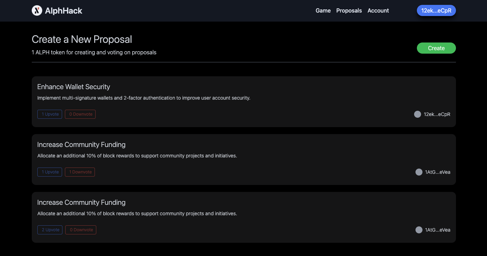

# AlphHack



A full-fledged decentralized application (DApp) built on the Alephium blockchain, featuring:

## Key Features

- Gameplay: Engaging game for users to participate and earn rewards.
- Rewards Claims: Users can claim rewards in ALPH tokens.
- Proposal Creation: Users can create and submit proposals.
- Voting: Decentralized voting system for proposal approval.
- Admin Cash Out: Administrative functionality for cashing out rewards.

## Overview

AlphHack combines gaming, reward claiming, proposal creation, voting, and admin cash out functionalities in a single DApp, leveraging the Alephium blockchain's security and decentralization.

## Requirements

- NodeJs
- Alephium node (contract deployed on testnet)

## Running Locally

1. Clone the repository:
```sh
$ git clone https://github.com/Daltonic/alephium_hackathon.git
```


2. Install dependencies:

```sh
$ npm install # or yarn install
```

3. Start the Application:

```sh
$ npm run dev # or yarn dev
```

#### Useful links:
🏠 Alephium Website: https://alephium.org
🔥 Alephium Hackathon: https://dappmentors.org/links/muodqy
👨‍💻 Alephium Documentation: https://docs.alephium.org/dapps
🚀 Our Discord: https://dappmentors.org/links/ytexzd
💡 Our Website: https://dappmentors.org/